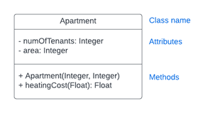

# 2-javaoop

Welcome! This topic has one or more small Java exercises to work through.

## What you'll learn

- Designing a class from a UML diagram, including choosing the right
  access modifiers (`private`/`protected`/`public`) for fields and methods.
- Writing constructors that initialize member variables.
- Writing getters and setters, including ones that enforce a constraint
  (e.g. a value that can't exceed a maximum).
- Object composition: a class that holds and manages an array of another
  class's objects.
- Overriding `toString()` to produce a custom, human-readable
  representation of an object.
- Inheritance: extending a class with `extends`, calling the parent's
  constructor with `super(...)`, and overriding one of its methods to
  change its behavior.
- Polymorphism: storing and calling a subclass object through its parent
  type, so code written against the parent class keeps working unchanged
  no matter which subclass is actually there.

## The exercises

| Exercise | Name | File | Points |
|---|---|---|---|
| 1 | Apartment | `src/main/java/exercises/Apartment.java` | 1 |
| 2 | Vehicle | `src/main/java/exercises/Vehicle.java` | 1 |
| 3 | Garage | `src/main/java/exercises/Garage.java` | 2 |
| 4 | ElectricVehicle | `src/main/java/exercises/ElectricVehicle.java` | 3 |

Each exercise has a `TODO` in its class to fill in, and a matching test file
you can use to check your work as you go. You don't need to touch the test
files — they're just there to help you see how you're doing. All four
classes start out completely empty, so you'll need to design the fields,
constructor(s), and methods yourself from the descriptions below — that's
expected to show as failing tests until you do.

There's also a `Main.java` with a `main` method, so you have something
runnable from the start — it doesn't do anything yet, it's just there so
your "Run" button works right away.

## Exercise descriptions

### 1. Apartment (1p)

Create a class called `Apartment` based on the UML class diagram below:



Pay attention to the access modifiers for each member variable or method.

As you see, a constructor with two parameters is needed: the number of
tenants as the 1st parameter and the area of the apartment as the 2nd
parameter.

Add method `heatingCost` taking the electricity price (kw/h) as `Float`.
Then, the method calculates the heating costs as
`numOfTenants * area * price` and returns it.

### 2. Vehicle (1p)

Create Java class `Vehicle` that has

- Protected member variable `fuelConsumption` that is type `Double`. This
  stores how much fuel the vehicle uses per 100km.
- Protected member variables `tankSize` and `gas` that are type `Double`,
  and store the maximum tank capacity and current amount of fuel in the
  vehicle as litres.
- Constructor with parameters that initializes the member variables
  `tankSize` and `fuelConsumption`. Constructor also fills up the tank.
- Getter for `tankSize`.
- Getter & setter for `gas`, which will either take gas or put more gas
  into the tank. Obviously, it's not possible to add more fuel than the
  tank capacity.
- Public method `drive`, that takes distance driven (kilometers) as
  parameter of type `Double`. The method calculates and removes the fuel
  the drive has taken and returns the remaining amount of fuel in the tank.
  Obviously, the tank can't have a negative amount of fuel.
- Protected method `unitLabel` (no parameters) that returns the `String`
  `"l gas left"`. `Garage` uses this (see below) to describe how much is
  left in a vehicle, without needing to know what kind of vehicle it is.

### 3. Garage (2p)

Create class `Garage` that hosts four vehicles as an array. Reuse the class
`Vehicle` from the previous exercise. Additionally:

- The vehicle array is private.
- The class has a constructor. By default all vehicles in the array are
  initialized as `null`.
- Method `addVehicle(Integer position, Double tankSize, Double fuelConsumption)`
  creates a new `Vehicle` at the given position in the array. The method
  does not return anything.
- Method `drive(Integer position, Double distance)` calls the `drive`
  method of the `Vehicle` in `position` with parameter `distance`. If
  there is no vehicle in the array in `position`, `null` is returned. If
  there is a vehicle, the result from the `drive` method for the `Vehicle`
  class is returned.
- Method `refuel` (without parameters) that fills out the tanks in all
  vehicles and returns the amount of fuel needed. Fuel is consumed in
  vehicles when the `drive` method of the `Vehicle` class is called.
- Override the method `toString` (from the `Object` class), that returns
  the garage information as one line per vehicle in the garage. Each line
  reports the remaining amount from `getGas()` followed by that vehicle's
  own `unitLabel()`, so the wording adapts to whatever kind of vehicle is
  actually stored there. If there is no vehicle in a slot, report it as
  empty.

  For example:

  ```
  Vehicle 1: 57.48l gas left
  Vehicle 2: 0.00l gas left
  Vehicle 3: 93.84l gas left
  Vehicle 4: empty
  ```

- Method `addVehicle(Integer position, Vehicle vehicle)` — an overloaded
  version that places an already-constructed `Vehicle` at the given
  position, overwriting whatever was there before. Because it takes a
  `Vehicle`, it also accepts any subclass of `Vehicle`, such as the
  `ElectricVehicle` from the next exercise, without `Garage` needing any
  further changes — `drive`, `refuel`, and `toString` keep working exactly
  as before.

### 4. ElectricVehicle (3p)

Create class `ElectricVehicle` that `extends Vehicle`, reusing its
`tankSize`/`gas` fields to represent battery capacity and remaining charge
(both in kWh), and `fuelConsumption` to represent energy use per 100km
(kWh/100km).

Add a private member variable `regenRate` of type `Double`: the fraction of
driving energy recovered through regenerative braking (e.g. `0.2` means 20%
of it is recovered).

- Constructor with three parameters — battery capacity, consumption rate,
  and `regenRate`, in that order — that calls the `Vehicle` constructor via
  `super(...)` to set up and fully charge the battery, then stores
  `regenRate`.
- Override the `drive` method: same signature and rules as `Vehicle.drive`
  (returns the remaining charge, which can't go negative), but the energy
  consumed is reduced by `regenRate`, i.e.
  `distance / 100 * fuelConsumption * (1 - regenRate)`.
- Override `unitLabel` to return `"kWh battery left"` instead of the
  `Vehicle` default, so `Garage`'s `toString` describes an `ElectricVehicle`
  correctly too.

  For example, a `Garage` holding one plain `Vehicle` and one
  `ElectricVehicle` (added via `addVehicle(Integer position, Vehicle vehicle)`)
  reports:

  ```
  Vehicle 1: 60.00l gas left
  Vehicle 2: 42.00kWh battery left
  Vehicle 3: empty
  Vehicle 4: empty
  ```

Since an `ElectricVehicle` **is a** `Vehicle`, an existing `Garage` can hold
one via the `addVehicle(Integer position, Vehicle vehicle)` method above and
call `drive` on it, or include it in `toString`, without any further changes
to `Garage` — the overridden `drive` and `unitLabel` both run automatically.
That's polymorphism: `Garage` only ever talks to the `Vehicle` type, and
doesn't need to know (or care) which subclass is actually stored at each
position.

## Step by step

1. **Clone this repo in VS Code**: open VS Code, click the **Source Control**
   icon in the left sidebar, then **Clone Repository**. Paste this repo's
   URL, pick a folder to clone it into, and click **Open** when VS Code asks
   whether to open the cloned repo.
2. **Run the tests before changing anything**, just to see where you're
   starting from. Click the flask-shaped **Testing** icon in the left
   sidebar, then the play button at the top of the Test Explorer panel —
   everything will be red at first, and that's completely normal.
3. **Implement each exercise** in its source file, one at a time.
4. **Re-run the tests** after each change to see your progress. Prefer a
   terminal? `mvn test` does the same check for all exercises at once.
5. **Work locally** until everything passes.
6. **Push your work back** to the GitHub organization when you're ready,
   using the **Source Control** view:
   - Hover over **Changes** and click the **+** icon to stage all your
     changes (or stage files one by one).
   - Type a commit message in the box at the top, e.g. `Exercises done`.
   - Click the arrow next to the **Commit** button and choose
     **Commit & Push** — this commits and pushes to GitHub in one step.
7. **Assignment completed — good job!**
